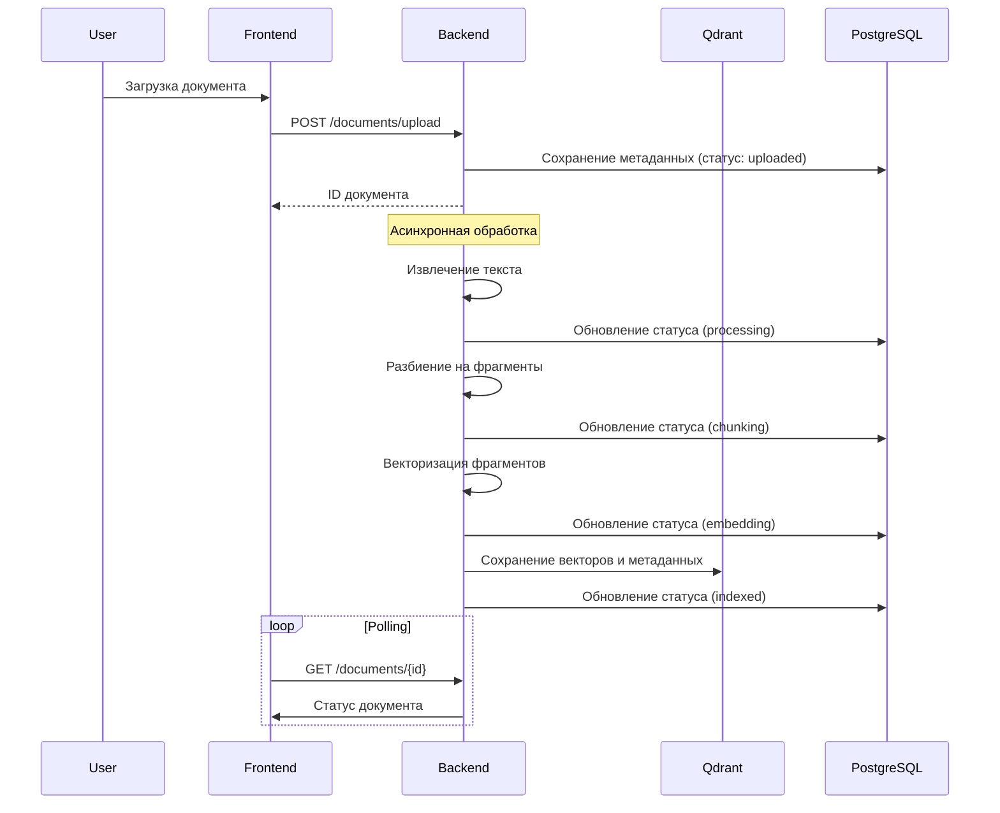
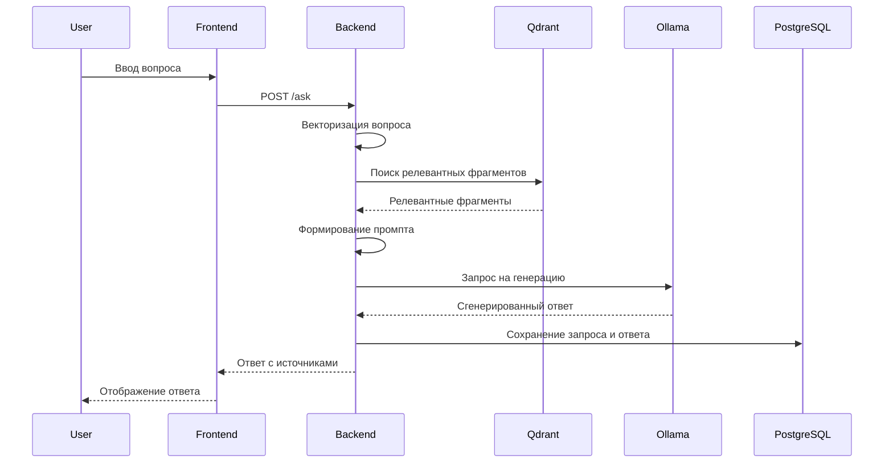

# Архитектура RAG-системы

Система построена на основе микросервисной архитектуры с использованием Docker, что обеспечивает гибкость, масштабируемость и простоту развертывания.

## Общая архитектура

*Примечание: изображение архитектуры условное, его нужно создать.*

## Основные компоненты

### 1. Бэкенд (FastAPI)

Бэкенд реализован на FastAPI и предоставляет REST API для всех функций системы:

- **Модуль `app/main.py`**: Основной файл приложения, маршрутизация и инициализация
- **Модуль `app/rag.py`**: Реализация RAG-сервиса, векторизации и поиска
- **Директория `app/chunking/`**: Компоненты для разбиения документов на фрагменты
- **Директория `app/retrieval/`**: Компоненты для векторного и гибридного поиска
- **Директория `app/routers/`**: API-маршруты для работы с системой
- **Модули `app/models.py`, `app/schemas.py`**: Модели данных и схемы API

#### Основные классы

- `RAGService` - центральный класс для обработки RAG-запросов
- `Vectorizer` - класс для векторизации текстовых фрагментов
- `QdrantIndex` - класс для работы с векторной базой данных
- `HybridRetriever` - класс для гибридного поиска
- `UnifiedChunker` и его подклассы - для разбиения документов на фрагменты

### 2. Векторная база данных (Qdrant)

Qdrant используется для хранения и поиска векторных представлений текстовых фрагментов:

- Хранит эмбеддинги фрагментов документов
- Поддерживает векторный поиск с cosine similarity
- Предоставляет REST API для работы с векторами
- Хранит метаданные фрагментов вместе с их векторами

### 3. Реляционная база данных (PostgreSQL)

PostgreSQL используется для хранения структурированных данных:

- Информация о пользователях и их настройках
- Метаданные загруженных документов и их статусы
- История запросов и ответов
- Настройки моделей для каждого пользователя

#### Основные таблицы

- `users` - информация о пользователях
- `documents` - информация о загруженных документах
- `chats` - история запросов и ответов
- `model_configs` - настройки моделей для пользователей

### 4. Языковая модель (Ollama)

Ollama предоставляет доступ к локальным языковым моделям:

- Запуск локальных LLM (по умолчанию mistral:7b-instruct)
- API для генерации текста
- Поддержка различных моделей и параметров генерации

### 5. Фронтенд (React)

Фронтенд реализован на React и предоставляет пользовательский интерфейс:

- **Директория `frontend/src/pages/`**: Основные страницы приложения
- **Директория `frontend/src/components/`**: Многоразовые компоненты
- **Директория `frontend/src/services/`**: Сервисы для работы с API

#### Основные компоненты

- `ChatPage` - интерфейс для задания вопросов и просмотра ответов
- `DocumentsPage` - управление документами и мониторинг их обработки
- `FileUpload` - компонент для загрузки документов
- `ModelSettings` - настройки параметров генерации
- `RelevantChunks` - отображение найденных фрагментов и их релевантности

## Потоки данных и процессы

### 1. Процесс загрузки и индексации документов

### 2. Процесс генерации ответа

## Модули чанкинга

Система поддерживает четыре стратегии разбиения документов на фрагменты:

1. **character** - разбиение по символам с учетом разделителей
   - Класс `RecursiveCharacterTextSplitter`
   - Параметры: `chunk_size`, `chunk_overlap`

2. **token** - разбиение по токенам моделей
   - Класс `TokenTextSplitter`
   - Параметры: `max_tokens`, `overlap_tokens`

3. **semantic** - семантическое разбиение с учетом смысловой нагрузки
   - Использует семантические эмбеддинги для определения границ
   - Старается сохранять семантические единицы

4. **hierarchical** - иерархическое разбиение с учетом структуры документа
   - Класс `HierarchicalChunker`
   - Учитывает заголовки и структурные элементы
   - Параметры: `min_chunk_size`, `max_chunk_size`, `heading_patterns`

## Гибридный поиск

Система использует гибридный подход к поиску, комбинируя:

1. **Dense Retrieval** - поиск на основе векторных представлений
   - Использует эмбеддинги из моделей типа E5
   - Находит семантически похожие фрагменты

2. **Sparse Retrieval** - поиск на основе BM25
   - Лексический подход на основе частоты встречаемости слов
   - Хорошо работает для точных соответствий

3. **Переранжирование** - уточнение результатов с помощью cross-encoder
   - Использует модели типа cross-encoder/ms-marco-MiniLM
   - Переоценивает пары "запрос-документ" для более точной релевантности

Веса компонентов поиска настраиваются через параметры:
- `dense_weight` - вес векторного поиска
- `sparse_weight` - вес BM25 поиска
- `reranker_weight` - вес переранжирования

## Интеграция с Ollama

Взаимодействие с локальными языковыми моделями осуществляется через Ollama:

- **Класс `OllamaClient`** (`app/ollama_client.py`)
- Возможность выбора модели из доступных в Ollama
- Настройка параметров генерации (temperature, top_p и др.)
- Формирование промптов с найденным контекстом

## Система аутентификации и авторизации

- Аутентификация на основе JWT-токенов
- Роли пользователей: `user`, `admin`
- Хэширование паролей с использованием bcrypt
- Контроль доступа к API-эндпоинтам на основе ролей

## Масштабирование и отказоустойчивость

- Система контейнеризирована с помощью Docker
- Компоненты могут масштабироваться независимо
- Postgres и Qdrant поддерживают персистентное хранение данных через volumes
- Асинхронная обработка документов с использованием многопоточности

## Логирование и мониторинг

- Настраиваемое логирование с ротацией логов
- Отдельные файлы логов для разных компонентов системы
- Отслеживание прогресса обработки документов
- API для проверки состояния системы 